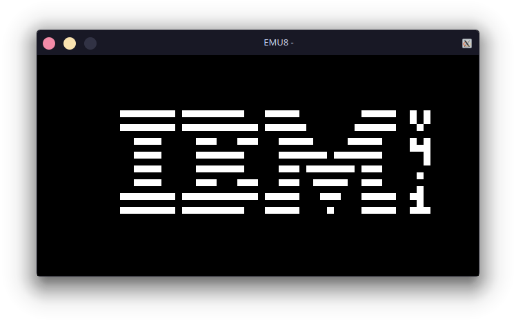

# Emu8
An Emulator/Interpreter for CHIP-8 written in C using SDL2\
Github repo is the mirror of [Codeberg](https://codeberg.org/skinatro/emu8)

### Keyboard Mapping
| Keyboard |       |      |       |       | CHIP-8 |       |      |       |
| :------: | :---: | ---: | :---: | :---: | :----: | :---: | ---: | :---: |
|   Esc    |       |      |       |   →   |  Stop  |       |      |       |
|    1     |   2   |    3 |   4   |   →   |   1    |   2   |    3 |   C   |
|    Q     |   W   |    E |   R   |   →   |   4    |   5   |    6 |   D   |
|    A     |   S   |    D |   F   |   →   |   7    |   8   |    9 |   E   |
|    Z     |   X   |    C |   V   |   →   |   A    |   0   |    B |   F   |

## Usage
 `emu8 /path/to/rom.ch8`
 You can acquire test roms on [Timendus's Test Suite](https://github.com/Timendus/chip8-test-suite)
 
__NOTE__ : The wav file must be named 440.wav and must be in the same directory as the executable/ 

## Building
### *Nix
 __Depdendencies:__
- make
- SDL2
- gcc / clang
- *nix system

__Compiling:__ Just run `make all` to compile, `make clean` to remove the binaries and `make rebuild` to clean and compile everything

__Note 1:__ You can pass `-j$(nproc)` to speed the build process.\
__Note 2:__ The binary produced does not has the debug information stripped and is compiled with the `-g` and `-ggdb` flags.

## Resources

- [WIKIPEDIA](https://en.wikipedia.org/wiki/CHIP-8)
- [Cowgod's Reference](http://devernay.free.fr/hacks/chip8/C8TECH10.HTM)
- [CHIP8 Guide by Tobias VL](https://tobiasvl.github.io/blog/write-a-chip-8-emulator/)
- [Queso Fuego's Playlist](https://www.youtube.com/watch?v=YvZ3LGaNiS0&list=PLT7NbkyNWaqbyBMzdySdqjnfUFxt8rnU_)
- `#chip-8` on EmuDev Discord

## ToDo
### Near Future
- [ ] Clean Up The Codebase & 
   - [ ] Also Use SDL_Log Instead Of Printf 
   - [ ] Use SDL_Open Instead Of fopen() ?
- [ ] Generate The Sound Using SDL (Without Needing to Rely On A WAV)
- [ ] Add OOB Checks
- [ ] Add Config File Support 
    - [ ] Add Keyboard Re-Mapping
### Future
- [ ] Add Windows Build Instructions
- [ ] Add Debugger
- [ ] Add Support For XO-CHIP, SCHIP, ETC
- [ ] UI Support
- [ ] Pause State
## Thanks To
- Janitor Raus
- Gulrak
- cortexauth

## License

This software is licensed under the __BSD 2-Clause "Simplified" or "FreeBSD" License__. You can find the full license text [here](https://opensource.org/licenses/BSD-2-Clause).

In short, this license allows you to freely use, modify, and redistribute the code for any purpose, commercial or non-commercial, as long as you retain the copyright notices and the license disclaimer in the original source files and any derivative works. You are also obligated to provide a copy of the license text along with the code when redistributing it.
